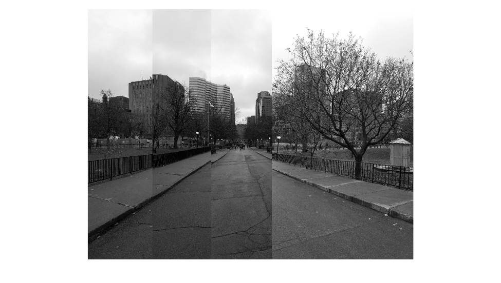
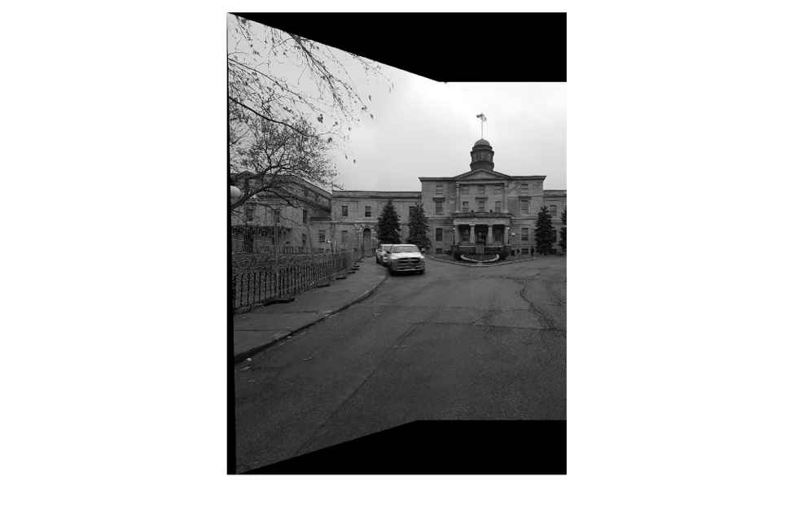

# Stitch images by using a homography matrix

In this project, I practiced using image features (sift features) to identify similar points in two images, and use these similar points to compute a homography matrix, which could be used to stitch two images.

We assumed that input images were taken by rotating the camera around its optical center, so images can be stitched with translation. Suppose I’m stitching images A and B and I found a homography matrix H which makes B = H * A. After applying H directly on pixel coordinates of A, I got new pixel coordinates in the frame of B. Therefore, I can just find the left most transformed pixel coordinate and this is the cut off line of A. In other words, part of A to the right of the cut off line should be same as B. By finding this cut off line, I know exactly how much to translate an image in order to stitch them together. 

  

The panorama is not perfect, however the first two images (I started from right to left) are stitched well (same thing happened with the other dataset). I think this is due to some numerical problems. I have to round off new pixel coordinates (after applying the homography matrix) when finding the cut off line. I verified that my homography matrix is correct (See the image below)

  

I stitched two images together by using my homography matrix and matlab’s built-in functions. The result is pretty good, so my homography matrices should be correct. 
